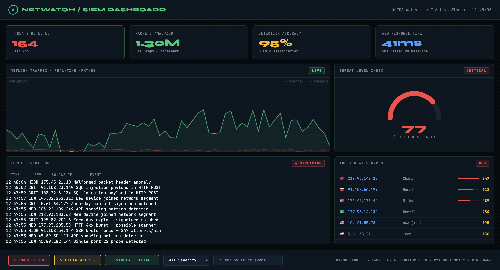

# NetWatch — SIEM Dashboard

A real-time network intrusion detection system (IDS) and SIEM dashboard built with Python, Scapy, and WebSockets. Captures and classifies live network traffic, then streams threat events to an interactive browser-based dashboard.



---

## Features

- **Live packet sniffing** via Scapy on any network interface
- **Threat classification** — detects SYN floods, port scans, ICMP floods, and sensitive port probes
- **Wireshark pcap replay** — test the classifier against captured traffic files
- **Real-time WebSocket streaming** — events pushed to the dashboard in under 100ms
- **Interactive SIEM dashboard** — live traffic graph, threat gauge, event log with filtering, and geo IP threat sources
- **Severity levels** — CRIT / HIGH / MED / LOW with colour-coded alerting

---

## Tech Stack

| Layer | Technology |
|---|---|
| Packet capture | Python 3, Scapy |
| Pcap analysis | Wireshark, tcpdump |
| Backend server | asyncio, websockets |
| Frontend | HTML, CSS, JavaScript (Canvas API) |

---

## How It Works

```
Network interface (en0)
        │
        ▼
  Scapy sniff()          ← or rdpcap() for pcap replay
        │
        ▼
  Packet classifier      ← rule-based heuristics (SYN flood, port scan, etc.)
        │
        ▼
  WebSocket server       ← broadcasts JSON events on ws://localhost:8765
        │
        ▼
  Browser dashboard      ← renders live traffic, logs, and threat gauge
```

---

## Threat Detection Rules

| Threat | Severity | Rule |
|---|---|---|
| SYN flood | CRIT | >80 SYN packets from one IP in 10s |
| Port scan | HIGH | >20 unique ports contacted from one IP in 10s |
| ICMP flood | HIGH | >30 ICMP packets from one IP in 10s |
| Sensitive port probe | MED | Traffic to ports 22, 23, 445, 3306, 3389, 1433 |
| DNS query | LOW | Any UDP port 53 traffic |
| General UDP | LOW | All other UDP traffic |

---

## Setup & Usage

### Requirements

- Python 3.8+
- macOS or Linux (root/sudo required for packet sniffing)

### Install dependencies

```bash
pip3 install scapy websockets
```

### Capture a pcap file (optional)

```bash
sudo tcpdump -i en0 -w capture.pcap -G 60 -W 1
```

### Run the backend

```bash
sudo python3 backend.py
```

If `capture.pcap` exists in the same directory, it will be replayed first before switching to live sniffing.

### Open the dashboard

Open `index.html` in your browser. You should see:

```
[NetWatch] Connected to Python backend
```

in the browser console, and events will start flowing into the dashboard immediately.

---

## Project Structure

```
netwatch-siem-dashboard/
├── index.html       # Dashboard UI
├── style.css        # Styles and design tokens
├── app.js           # Frontend logic and WebSocket client
├── backend.py       # Python IDS — Scapy sniffer + WebSocket server
└── .gitignore
```

---

## Resume Context

This project was built to demonstrate:

- Real-time intrusion detection using Python and Scapy
- Packet analysis and log correlation for SIEM-style alerting
- Integration with Wireshark pcap files for penetration testing scenarios
- Full-stack architecture connecting a Python backend to a live browser dashboard

---

## Author

**Harsh Singh** — [github.com/harshsingh4469](https://github.com/harshsingh4469)